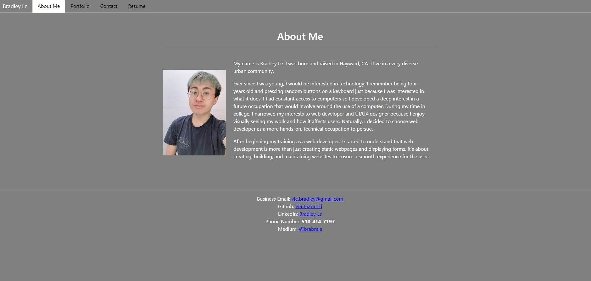
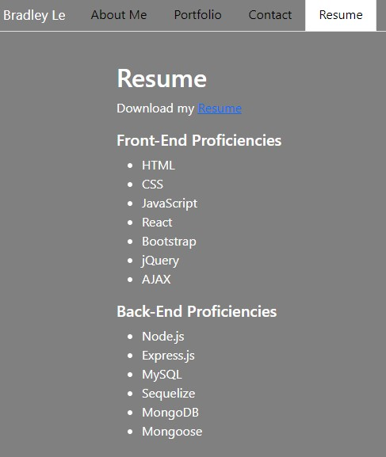

# react-to-my-portfolio

This portfolio is created by using React. The pages are dynamically updated instead of having the user be redirected to a new page.

## Built With

* [HTML](https://developer.mozilla.org/en-US/docs/Web/HTML)
* [CSS](https://developer.mozilla.org/en-US/docs/Web/CSS)
* [Javascript](https://developer.mozilla.org/en-US/docs/Web/JavaScript)
* [React](https://www.npmjs.com/package/react)
* [Bootstrap](https://www.npmjs.com/package/bootstrap)

## Deployed Link

* [See Live Site](https://pentazoned.github.io/react-to-my-portfolio/)

## Screenshots and Gif

## Authors

* **Bradley Le** 

- [Link to Portfolio Site](https://pentazoned.github.io/react-to-my-portfolio/)
- [Link to Github](https://github.com/pentazoned)
- [Link to LinkedIn](https://www.linkedin.com/in/bradley-le-/)

## License

This project is licensed under the MIT License 
